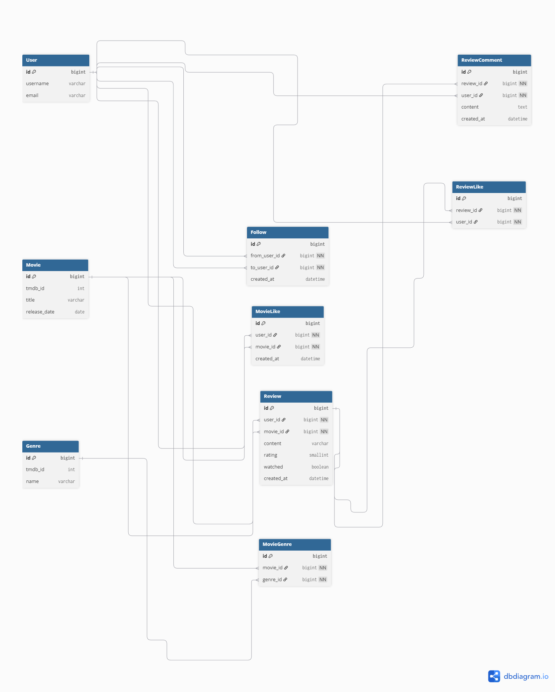

# 혜성 (Comet)
사용자 취향 기반 AI 영화 추천 및 커뮤니티 서비스

- 개발 기간: 2025.12.19 ~ 2025.12.25 (1학기 최종 프로젝트)

---

## 1. 프로젝트 소개
**혜성(Comet)**은 사용자의 취향 데이터를 기반으로 영화를 추천하고, 영화에 대한 코멘트/좋아요/보고싶어요 기능을 통해 커뮤니티 활동까지 연결하는 서비스입니다.

---

## 2. 팀원 소개
| 이름 | 역할 | 담당 |
|---|---|---|
| 김혜령(팀장) | Back-end / Front-end | DB 설계 및 백엔드 전반 구축, 프론트 구현 및 리팩토링, 일정/이슈 관리 |
| 이규성(팀원) | Front-end / Back-end | UI/UX 시안 디자인, 프론트 구조 설계 및 구현, 백엔드 기능 보조 |

---

## 3. 기술 스택 (Tech Stack)
- Frontend: Vue.js 3, Pinia, Bootstrap 5  
- Backend: Python, Django REST Framework (DRF)  
- Data & AI: TMDB API, GMS_KEY, VITE_YOUTUBE_API_KEY  
- Tools: Git, Figma, Notion  


---

## 4. 핵심 기능 (GIF)

### (1) 페이지 공통 기능


- 반응형 웹 디자인: 860px 이하 모바일 환경 대응(햄버거 메뉴)
- 7가지 컬러 테마: 사용자 테마 변경
- 마이크로 인터랙션: 버튼/카드 호버 시 확대, 커서 변경
- 랜덤 배너 & 큐레이션: 접속 시마다 새로운 추천 + 평점/최신/관객수 기준 제공
- Footer: 개인정보처리방침/이용약관, 맨 위로 이동 버튼
- 새 페이지 진입 시 스크롤 최상단 이동

---

### (2) 메인페이지


- 메인 배너: 랜덤 영화 추천(클릭 시 상세 페이지 이동) + 서비스 가이드 이동
- 관객수/평점 기반 추천 영화(더보기 → 추천 검색 이동)
- 최신 개봉작(더보기 → 최신 검색 이동)
- 평론가 별점 순 작품(더보기 → 별점순 검색 이동)
- 최근 유저 코멘트(더보기 → 전체 코멘트)
- 코멘트 클릭시 코멘트 디테일 창 (user_id 검사 후 코멘트 수정/삭제 버튼, 댓글 작성, 댓글 삭제)

---

### (3) 회원가입 / 로그인


- 회원가입: 이메일 양식, 아이디 중복, 비밀번호 8자 이상 등 유효성 검사
- 로그인: 아이디/이메일 모두 로그인 가능

---

### (4) 영화 상세 페이지


- 좋아요 / 코멘트 / 보고싶어요 / 트레일러 시청(YouTube) 제공
- 좋아요: 마이페이지에서 확인 가능
- 코멘트: 작성/수정/삭제 가능 + 마이페이지에서 작성 영화 확인
- 보고싶어요: 보관함에서 확인 가능  
  - 코멘트 작성 시 자동으로 보고싶어요 목록에서 제거 + 코멘트 작성 영화로 이동
- 디테일 화면: Navbar 투명 처리, 상단 가로 포스터 + 제목/장르/연도 배치
- 출연/제작 인물 클릭 시 인물 상세 페이지 이동
- 코멘트 더보기: 좋아요/최신순 정렬
- 관련 장르 추천 영화(인기순) 배치

---

### (5) 취향분석 페이지


- 시청한 영화: 코멘트 작성 영화 기반으로 목록 제공(전체 보기 가능)
- 최애 장르: 장르별 모아보기(필터/검색)
- 평균 별점: 사용자 별점 평균 제시 + 별점별 모아보기
- 레이더 차트(Radar Chart): 장르 분포를 시각적으로 제공
- 최근 시청 영화 기반: 관련 장르 순위별 추천 제시

---

### (6) 추천 탭


- AI 맞춤 추천(채팅): 다중 대화 지원  
  - `SYSTEM_PROMPT_REASONS`, `SYSTEM_PROMPT_FILTER`로 규칙/출력 형식 제한
- 장르 추천: 장르별 평균 별점(5점 만점) 제시 + 필터링
- 인물 추천:
  - 랜덤 인물 제시 / 다른 인물 보기 / 인물 검색 / 인기 인물 선택
  - 하트(좋아요) → 마이페이지에서 확인
  - 인물 상세: 출연/감독 구분 작품 제시 + 작품 추천
- 유저 추천: 리뷰 활동 많은 유저 추천
- 실시간 TOP 활동: 리뷰 작성 유도 + 새로고침 버튼

---

### (7) 도움말 탭


- 서비스 이용 가이드 및 전반적인 소개

---

### (8) 마이페이지


#### 프로필 수정
- 사진 변경 / 이름 변경 / 비밀번호 변경 / 회원탈퇴

#### 팔로잉/팔로워
- 목록 모달 제공 → 유저 클릭 시 유저 상세 페이지 이동

#### 보관함
- 코멘트 작성 영화 / 좋아요 영화 / 보고싶은 영화
- 더보기 + 드롭다운 정렬(담은순/역순/내 별점 높은순/낮은순/신작/구작)

#### 좋아요
- 좋아요 인물(카드 표시 + 해제 가능)
- 좋아요한 코멘트(드롭다운 + 코멘트 상세 이동)
- 더보기로 전체 확인

---

### 5.1 인증/권한 처리
- 토큰 저장 및 로그인 상태 유지 (Pinia Store)
- API 요청 시 인증 헤더 자동 적용 (Axios Interceptor)

> 관련 파일: `src/stores/auth.js`, `src/api/axios.js`

<details>
  <summary>핵심 코드 보기 (Pinia: 로그인 상태 복구 & 토큰 저장)</summary>

```js
// src/stores/auth.js (핵심 부분 발췌)

// ✅ 앱 최초 진입 / 새로고침 시 로그인 상태 복구
async bootstrap() {
  const access = localStorage.getItem('access') // 로컬 토큰 확인
  if (!access) {
    this.user = null // 토큰 없으면 비로그인 처리
    return
  }

  try {
    const me = await fetchMe() // ✅ 토큰으로 내 정보 조회
    this.user = me // ✅ 로그인 상태 복구
  } catch (e) {
    // ✅ 토큰이 만료/오류이면 깨끗하게 정리
    localStorage.removeItem('access')
    localStorage.removeItem('refresh')
    this.user = null
  }
},

// ✅ 로그인 성공 시 토큰 저장 + user 상태 세팅
async login(payload) {
  this.loading = true
  try {
    const res = await apiLogin(payload) // 백엔드 로그인 API 호출
    const { user, tokens } = res // { user, tokens:{access, refresh} }

    if (tokens?.access) localStorage.setItem('access', tokens.access) // ✅ access 저장
    if (tokens?.refresh) localStorage.setItem('refresh', tokens.refresh) // ✅ refresh 저장

    this.user = user // ✅ 화면에서 즉시 로그인 상태 반영
    return res
  } finally {
    this.loading = false
  }
},
</details>

### 5.2 영화 데이터 수집/가공 (TMDB)
- 공통 fetch 유틸로 엔드포인트별 중복 제거
- 목록/상세/검색/큐레이션 로직 분리

> 관련 파일: `src/api/tmdb.js`, `src/stores/movie.js`

### 5.3 코멘트/좋아요/보고싶어요 도메인 로직
- 동일 컴포넌트에서 상태 변화(추가/삭제/수정) 즉시 반영
- 마이페이지 보관함과 상세 페이지 연동

> 관련 파일: `src/stores/review.js`, `src/components/review/*`

### 5.4 AI 추천(프롬프트 제어)
- SYSTEM_PROMPT로 출력 포맷 제한 및 추천 근거 제공
- 사용자 입력을 필터링/정규화하여 일관된 결과 유도

> 관련 파일: `src/components/recommend/*`
---


## 6. ERD (Entity Relationship Diagram)
핵심 도메인(User–Follow / Movie–Genre / Review–Comment / Like)을 중심으로 ERD를 구성했습니다. 
- Review는 (user_id, movie_id) 기준으로 1인 1리뷰를 보장합니다.
- Like/Follow는 중복을 방지하기 위해 유니크 제약을 적용했습니다.

### 핵심 ERD


<details>
  <summary>전체 ERD 보기</summary>
  <br/>
  
</details>


---

## 7. Component Structure
Vue.js 컴포넌트 구조도
“View는 흐름(라우팅/상태), Component는 UI 재사용” 원칙으로 구조화
카드/행(Row) 컴포넌트는 여러 화면에서 동일 UI를 공유
모달/폼 컴포넌트는 기능 단위로 분리해 유지보수/확장성 강화

<details>
  <summary>컴포넌트 구조 보기</summary>
  <br/>
  
</details>


---

## 8. 회고
- 잘 된 점
- 아쉬운 점
- 다음 개선 계획
